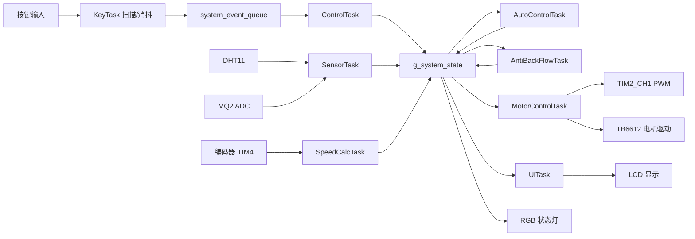

# 基于 STM32 + FreeRTOS 的智能油烟机闭环控制与在线升级预留系统项目说明书

## 第 1 章 引言

### 1.1 项目背景

随着厨房电器向智能化、自动化方向发展，抽油烟机作为核心的排烟设备，其主要作用是及时排出烹饪产生的油烟和有害气体。然而，传统油烟机大多依赖人工按键控制，用户在爆炒等油烟突增的场景下手动调节往往存在滞后性，容易导致排烟不足或高档位空转造成的能耗与噪声问题。

即便部分产品引入了基于气体传感器的自动启停功能，也多采用简单的“单阈值”逻辑（即浓度超过某一点就开机，低于该点就停机）。在真实的厨房环境中，气流扰动极易导致传感器读数在阈值附近上下波动，从而引发风机的频繁启停（震荡），这不仅严重影响用户体验，还会缩短电机寿命。

为解决上述痛点，本项目设计并实现了一套基于 STM32F103RCT6 主控和 FreeRTOS 实时操作系统的智能控制系统。该系统利用多传感器数据融合与滞回状态机算法，实现了平滑的无级调速与抗扰动的防回流控制，并通过规范的分层软件架构，为后续的 PID 闭环调速与在线升级（OTA）预留了工程接口。

### 1.2 做本项目需要的前置基础知识

本项目并非简单的外设模块拼接，而是涉及了实时操作系统、状态机设计与底层硬件解耦的综合性嵌入式工程。如果你准备复现或在此基础上二次开发本项目，建议先具备以下基础知识：

1. **C语言与模块化编程能力**
* 熟练掌握结构体（Struct）与枚举（Enum）的使用（如本项目中的 `SystemState_t` 全局状态机结构）。
* 理解指针传递与多文件工程中的头文件管理（避免重复包含与类型重定义冲突）。


2. **STM32 单片机与核心外设机制**
* **GPIO 与外设复用**：理解推挽/开漏输出的区别，以及按键的上/下拉输入配置。
* **定时器（TIM）**：需要掌握利用 TIM 输出 PWM 波来控制 TB6612 电机驱动，以及利用 TIM 的编码器模式（Encoder Mode）捕获 A/B 相正交脉冲计算转速。
* **ADC 采样**：了解如何利用 ADC 获取 MQ2 模拟气敏传感器的电压值并做基础处理。
* **通信接口**：掌握 USART 串口调试打印，以及通过软件 IO 模拟 SPI 驱动 ST7735 LCD 屏幕。


3. **FreeRTOS 实时操作系统基础**
* **任务调度（Task）**：理解任务的创建、优先级分配（如关机任务优先级最高，UI 刷新任务优先级最低）以及任务周期的概念。
* **任务间通信（Queue）**：了解如何使用消息队列处理离散事件（如异步投递按键短按/长按动作）。
* **并发保护（Mutex）**：懂得使用互斥锁来保护全局共享数据，防止多任务同时读写导致的脏数据。


4. **硬件电路与控制逻辑基础**
* 理解基础的电路知识，特别是**自锁电源电路**的工作原理（如何通过 `KEY_POWER` 与 `PWR_HOLD` 软硬件握手实现长按开/关机）。
* 理解基础的有限状态机（FSM）思想，这对于复现项目中的“防回流控制”与“按键消抖动作识别”至关重要。


### 1.3 项目设计目标

本项目的总体设计目标是：构建一套架构清晰、运行稳定、具备自我调节能力的智能油烟机嵌入式系统平台。具体目标如下：

1. **稳定安全的电源管理**：实现可靠的按键自锁与软硬件协同长按关机，杜绝异常掉电复位后的供电误保持。
2. **解耦的软件架构**：剥离底层硬件与上层业务，使得按键扫描、传感器读取、电机调速和屏幕刷新互不阻塞。
3. **平滑的智能调速**：克服直流电机低速启动死区，并基于多环境传感器数据进行加权融合，给出符合实际烹饪情况的平滑目标转速。
4. **抗扰动的排风控制**：通过动态切换判断阈值与延时退出机制，彻底消除油烟浓度波动带来的风机频繁启停现象。
5. **良好的工程延展性**：打通转速反馈链路，提供 UI 监控界面，并预留串口升级入口，为向更高级的设备演进提供基础。

### 1.4 项目主要功能

1. **电源自锁与保护**：上电校验实体按键状态，运行中长按主动释放电源锁存引脚关机。
2. **全维度人机交互**：面板四按键（模式、风速、照明、升级）支持短按/长按异步识别，辅以 RGB 状态灯与 $60\text{ms}$ 蜂鸣器操作反馈。
3. **手动多档位与启动助推**：手动模式支持 STOP、LOW、MID、HIGH 循环切换，电机冷启动时自动注入瞬时高占空比克服静摩擦死区。
4. **多源感知与综合自适应调速**：自动模式下，系统实时采集温度、湿度与 MQ2 气体浓度，通过内置权重矩阵解算出综合恶劣系数并映射为电机目标转速。
5. **四阶防回流状态机控制**：针对气体浓度突变，流转于空闲、监测、激活、恢复四态，触发时强制接管并输出高转速排烟，油烟散去后强制执行 $10\text{s}$ 观察期防止二次震荡。
6. **硬件级正交测速**：利用定时器编码器接口读取风机 A/B 相脉冲，计算出精准物理 RPM 用于状态监控与后续 PID 闭环。
7. **全景运行状态可视化**：驱动 ST7735 彩屏，结构化呈现工作模式、温湿度、气体百分比、目标与实际 RPM、PWM 占空比及底层状态标识。
8. **OTA 升级状态预留**：开放 USART2 通信通道与长按升级模式入口，为后期引入 Bootloader 与 ESP32 通信模块做好环境隔离。

### 1.5 项目技术路线

本项目在软件工程上采用“面向对象封装 + 多任务并发调度”的技术路线：

* **五层严密架构**：系统自下而上划分为 `Common`（引脚与全局状态映射）、`BSP`（板级底层外设支持）、`Driver`（传感器/执行器设备封装）、`Service`（控制算法与防回流业务逻辑）、`Application`（RTOS 任务调度）五层。严禁越级调用，确保代码具备极高的可移植性。
* **连续状态与离散事件双轨制通信**：瞬间发生的离散动作（如按键触发）打包入系统事件队列非阻塞投递；而连续变化的物理量（如温度、RPM）则统一交由受互斥锁（Mutex）保护的全局状态结构体 `g_system_state` 管理，确保并发读写的绝对安全。
* **按需分配的抢占式调度**：通过 FreeRTOS 创建 9 个业务 Task，将关机保护置于极高优先级，环境决策与电机控制置于中高优先级，而将最耗时的 LCD 屏幕 SPI 渲染降至最低优先级，完美规避了传统裸机开发中 UI 刷新卡顿导致核心控制流中断的致命缺陷。

### 1.6 本说明书章节安排

为系统剖析本项目的设计思想与实现细节，说明书后续章节安排如下：

* **第 2 章 系统总体方案设计**：从全局视角梳理系统的物理拓扑、状态数据流与工作模式划分。
* **第 3 章 硬件系统设计**：详解 MCU 选型原则，以及传感器、自锁电源、电机驱动与编码器等模块的硬件接线方案。
* **第 4 章 软件架构设计**：深入解析五层代码框架的作用，以及全局状态结构与系统引脚池的工程设计。
* **第 5 章 核心功能实现**：通过数学公式与逻辑流重点拆解：电源自锁验证、多传感器加权调速算法与防回流滞回状态机。
* **第 6 章 FreeRTOS 多任务设计**：揭示多任务划分的周期、优先级依据，以及队列与互斥锁的协同机制。
* **第 7 章 系统测试与调试**：记录联调过程中关于主控发热、低档位启动死区、LCD 刷新闪烁等典型工程痛点的排查与修复过程。
* **第 8 章 当前问题与后续改进方向**：评估当前系统局限，规划接入硬件滤波、PID 闭环以及 Bootloader 在线升级的具体演进路线。
* **第 9 章 项目总结**：提炼本项目的核心技术亮点与开源复现价值。

## 第 2 章 系统总体方案设计

### 2.1 系统总体设计思路

本系统面向智能油烟机控制场景进行设计，整体思路是将厨房环境检测、风机控制、人机交互和后续在线升级功能整合到同一个嵌入式控制平台中。系统不是简单地将多个外设堆叠在一起，而是按照“数据采集、状态决策、执行输出、状态显示”的流程进行组织。

系统运行时，DHT11 和 MQ2 负责采集环境数据；按键模块负责接收用户输入；自动控制模块根据传感器数据计算目标转速；防回流模块根据气体浓度状态判断是否需要提高风机输出；电机控制模块根据当前模式和目标转速输出 PWM；LCD、RGB 状态灯、蜂鸣器和串口负责反馈系统状态。各部分通过全局系统状态结构体和事件队列连接，形成较完整的控制闭环。

从工程实现角度看，系统采用 FreeRTOS 进行任务调度，将不同周期和不同实时性要求的功能拆分为多个任务。例如，按键扫描需要较短周期以保证手感，电机控制和编码器测速需要稳定周期以保证控制效果，传感器采集周期可以相对较长，LCD 刷新优先级可以较低。这种任务划分方式能够避免所有逻辑集中在一个大循环中，使程序结构更加清晰。

### 2.2 系统功能需求

根据项目目标，本系统主要包含以下功能需求。

第一，系统应支持可靠的电源自锁控制。用户按下电源键后，系统能够拉高 PWR_HOLD 引脚保持供电；用户长按电源键时，系统能够释放 PWR_HOLD 引脚实现关机。系统还应避免异常复位后误保持供电。

第二，系统应支持基本的人机交互。MODE 按键用于切换 OFF、MANUAL、AUTO 三种主要工作模式；SPEED 按键用于在手动模式下切换 STOP、LOW、MID、HIGH 档位；LIGHT 按键用于控制照明灯开关；UPGRADE 按键长按用于进入升级等待状态。

第三，系统应支持环境数据采集。DHT11 负责采集温度和湿度，MQ2 通过 ADC 采集气体浓度并转换为百分比显示。采集结果应能够通过串口和 LCD 输出，便于观察系统运行状态。

第四，系统应支持风机控制。手动模式下，系统根据用户选择的档位输出固定占空比；自动模式下，系统根据环境融合结果输出目标转速；防回流状态触发时，系统应能够提高目标转速，保证排烟能力。

第五，系统应支持编码器测速和闭环控制预留。当前阶段电机控制以开环 PWM 为主，但系统已经加入 TIM4 编码器测速链路，能够读取编码器计数差并换算 RPM，为后续 PID 闭环控制提供反馈基础。

第六，系统应支持状态显示。LCD 屏幕显示系统模式、风速档位、气体浓度、温湿度、当前转速、目标转速、PWM 占空比、照明灯状态和防回流状态；RGB 状态灯用于显示当前工作模式；蜂鸣器用于提供按键反馈。

第七，系统应支持在线升级预留。当前系统暂未实现完整 Bootloader 下载和烧写流程，但已经在按键逻辑、串口接口和工程结构中预留升级入口，后续可继续扩展。

### 2.3 系统整体架构

系统总体架构可以分为硬件层、驱动层、服务层和应用任务层。硬件层提供真实的输入输出资源；驱动层对单个设备进行封装；服务层实现产品业务逻辑；应用任务层负责 FreeRTOS 调度和周期管理。

系统总体架构图如下。

```mermaid
flowchart TB
    subgraph Hardware[硬件模块]
        KEY[MODE/SPEED/LIGHT/UPGRADE 按键]
        SENSOR[DHT11 温湿度 + MQ2 气体]
        MOTOR[TB6612 + 风机电机]
        ENC[编码器 A/B 相]
        LCD[ST7735 LCD]
        ACT[RGB 状态灯/照明灯/蜂鸣器]
        PWR[自锁电源]
    end

    subgraph BSP[BSP 板级支持层]
        GPIO[bsp_gpio]
        ADC[bsp_adc]
        TIM[bsp_tim]
        USART[bsp_usart]
        SPI[bsp_spi]
        POWER[bsp_power]
    end

    subgraph Driver[Driver 设备驱动层]
        DRVKEY[drv_key]
        DRVSENSOR[drv_sensor]
        DRVMOTOR[drv_motor_pwm]
        DRVENC[drv_encoder]
        DRVLCD[drv_lcd]
        DRVACT[drv_actuator]
        DRVCONSOLE[drv_console]
    end

    subgraph Service[Service 业务服务层]
        CTRL[control_service]
        SENSOR_S[sensor_service]
        SPEED[speed_service]
        MOTOR_S[motor_control_service]
        AUTO[auto_control_service]
        BACK[anti_backflow_service]
        UI[ui_service]
        EVENT[event_service]
    end

    subgraph App[Application FreeRTOS 任务层]
        POWER_T[PowerTask]
        KEY_T[KeyTask]
        CTRL_T[ControlTask]
        SENSOR_T[SensorTask]
        SPEED_T[SpeedCalcTask]
        MOTOR_T[MotorControlTask]
        AUTO_T[AutoControlTask]
        BACK_T[AntiBackFlowTask]
        UI_T[UiTask]
    end

    Hardware --> BSP --> Driver --> Service --> App
```



### 2.4 系统数据流设计

系统的数据流主要分为两类：一类是离散事件，例如按键短按、按键长按、升级请求等；另一类是连续状态，例如传感器数据、目标转速、当前 RPM、PWM 占空比等。

离散事件通过 FreeRTOS 队列传递。KeyTask 调用 Key_Scan() 识别按键动作后，将按键事件转换为 SystemEvent_t，并投递到 system_event_queue。ControlTask 从队列中阻塞等待事件，并调用 Control_Service_ProcessEvent() 完成模式切换、档位切换、照明灯控制和升级状态切换。

连续状态通过 g_system_state 统一保存。传感器任务更新温湿度和气体浓度；测速任务更新 current_rpm、encoder_delta 和编码器 A/B 电平；自动调速任务更新 auto_target_rpm 和 auto_factor；防回流任务更新 backflow_state、backflow_active 和 backflow_target_rpm；电机控制任务根据这些状态计算最终 target_rpm 和 pwm_duty。多个任务访问 g_system_state 时，通过 sys_data_mutex 保护，降低共享数据被并发读写导致异常的风险。

系统数据流图如下。



### 2.5 系统工作模式设计

系统当前主要包含 OFF、MANUAL、AUTO 和 UPDATE 四类模式。

OFF 模式表示风机停止状态。在该模式下，系统不输出风机 PWM，手动风机档位被复位为 STOP。该模式不代表整机断电，而是业务层面的关闭状态。真正断电由 PowerTask 和 PWR_HOLD 控制。

MANUAL 模式表示手动控制模式。在该模式下，用户通过 SPEED 按键切换风机档位。系统不根据传感器数据自动改变档位，风机输出主要由用户选择决定。该模式适合调试电机、测试不同 PWM 占空比以及模拟传统油烟机操作方式。

AUTO 模式表示自动调速模式。在该模式下，系统根据温度、湿度和 MQ2 气体浓度计算综合系数 F，并映射为自动目标转速。防回流状态机也只在 AUTO 模式下参与目标转速修正。当环境变化较大时，系统能够自动提高风机输出；当环境恢复平稳后，系统逐渐退出运行状态。

UPDATE 模式表示升级等待状态。用户长按 UPGRADE 按键后进入该状态。当前阶段该状态主要用于软件流程预留和状态显示，后续可接入 ESP32 或其他通信模块，实现固件下载、校验和跳转 Bootloader。

### 2.6 系统主要文件组成

当前工程主要目录如下。

```text
Common
  board_pins.h          引脚统一定义
  message_def.h         系统事件、队列和互斥锁声明
  system_state.h        全局状态结构体定义

BSP
  bsp_gpio.c/.h         GPIO 抽象
  bsp_adc.c/.h          MQ2 ADC 采样
  bsp_tim.c/.h          TIM2 PWM 和 TIM4 编码器
  bsp_usart.c/.h        USART 调试串口
  bsp_spi.c/.h          LCD 软件 SPI
  bsp_power.c/.h        自锁电源控制

Driver
  drv_key.c/.h          按键扫描、消抖、短按和长按识别
  drv_sensor.c/.h       DHT11 和 MQ2 传感器读取
  drv_motor_pwm.c/.h    TB6612 电机 PWM 驱动
  drv_encoder.c/.h      编码器计数读取
  drv_lcd.c/.h          ST7735 LCD 显示驱动
  drv_actuator.c/.h     RGB、照明灯、蜂鸣器执行器
  drv_console.c/.h      printf 串口输出适配

Service
  event_service.c/.h           事件投递封装
  control_service.c/.h         按键事件处理和模式管理
  sensor_service.c/.h          传感器采样服务
  speed_service.c/.h           编码器测速服务
  motor_control_service.c/.h   电机目标合成和 PWM 输出
  auto_control_service.c/.h    自动调速算法
  anti_backflow_service.c/.h   防回流状态机
  pid_service.c/.h             PID 控制算法预留
  ui_service.c/.h              LCD 页面刷新

Application
  app_main.c            FreeRTOS 资源创建和任务创建
  power_task.c          电源键长按关机任务
  task_key.c            按键扫描任务
  control_task.c        控制事件消费任务
  sensor_task.c         传感器采集任务
  task_speed.c          编码器测速任务
  task_motor.c          电机控制任务
  task_auto.c           自动调速任务
  task_anti_backflow.c  防回流任务
  task_ui.c             LCD 显示任务
```

## 第 3 章 硬件系统设计

### 3.1 主控芯片选型

本项目选用 STM32F103RCT6 作为主控芯片。该芯片基于 ARM Cortex-M3 内核，主频最高可达 72 MHz，具有较丰富的 GPIO、定时器、ADC、USART 等外设资源，能够满足本项目中按键输入、传感器采集、电机 PWM 输出、编码器测速、LCD 显示和串口通信等需求。

在项目调试过程中，曾出现链接阶段提示执行区域空间不足的问题。该问题主要与芯片型号配置和工程启动文件选择有关。如果工程仍按照小容量器件或中容量器件进行链接，FreeRTOS 内核、任务栈、队列、驱动模块和服务层代码很容易超过可用 Flash 或 RAM。将工程目标切换到 STM32F103RCT6 对应的大容量配置后，系统空间能够满足当前功能需求。

【原理图占位：主控 STM32F103RCT6 最小系统原理图】

### 3.2 自锁电源模块设计

系统采用按键自锁电源方案。用户按下电源键时，硬件电路先给系统提供临时供电，MCU 启动后检测 KEY_POWER 引脚。如果确认电源键处于按下状态，程序拉高 PWR_HOLD 引脚，使后级电源保持工作；如果不是按键开机，而是异常抖动或掉电过程中的复位，则程序不拉高 PWR_HOLD，系统会自动断电。

当前引脚分配如下。

| 功能 | MCU 引脚 | 说明 |
|---|---|---|
| PWR_HOLD | PC10 | 拉高保持系统供电 |
| KEY_POWER | PC13 | 电源按键输入，低电平有效 |

电源控制逻辑分为两个阶段。第一阶段在 main.c 中完成，上电后立即进行按键开机判断，避免 FreeRTOS 尚未启动时系统供电状态不确定。第二阶段在 PowerTask 中完成，系统运行期间周期检测电源键，当检测到长按时释放 PWR_HOLD，实现关机。

这种设计的优点是开机判断和运行期关机互不混淆。开机阶段只判断是否为真实按键启动，运行阶段只处理长按关机请求，能够减少异常复位、按键未松开和掉电抖动带来的误动作。

【原理图占位：自锁电源与电源按键原理图】

### 3.3 按键输入模块设计

系统面板包含 MODE、SPEED、LIGHT 和 UPGRADE 四个按键，均采用低电平有效方式。GPIO 初始化时配置为上拉输入，按键按下时引脚被拉低。

当前按键引脚分配如下。

| 按键 | MCU 引脚 | 功能 |
|---|---|---|
| KEY_MODE | PB10 | 短按切换 OFF、MANUAL、AUTO 模式 |
| KEY_SPEED | PB11 | 手动模式下短按切换风速档位 |
| KEY_LIGHT | PC5 | 短按切换照明灯开关 |
| KEY_UPGRADE | PC11 | 长按进入升级等待状态 |

按键检测由 drv_key.c 实现，主要包括原始电平读取、消抖处理、稳定电平判断、短按事件识别和长按事件识别。当前扫描周期为 10 ms，消抖时间为 30 ms，长按判断时间为 1500 ms。KeyTask 周期调用 Key_Scan()，当检测到有效按键事件后，将事件投递到 system_event_queue。

采用任务周期扫描按键的方式，能够避免每个按键都使用外部中断带来的复杂性。对于油烟机面板按键这类低频输入，10 ms 周期扫描已经能够满足响应要求，同时也便于在软件中统一处理消抖和短按/长按判断。

【原理图占位：四个面板按键原理图】

### 3.4 传感器采集模块设计

系统采用 DHT11 和 MQ2 作为环境检测传感器。其中 DHT11 用于采集温度和湿度，MQ2 用于检测厨房环境中的可燃气体或烟雾浓度变化。

当前引脚分配如下。

| 传感器 | MCU 引脚 | 说明 |
|---|---|---|
| DHT11 | PC0 | 单总线数字温湿度传感器 |
| MQ2 | PA1 / ADC1_CH1 | 模拟气体传感器，ADC 采样 |

DHT11 的数据读取由驱动层完成，驱动通过 GPIO 模拟单总线时序获取温湿度数据。MQ2 输出为模拟电压，系统通过 ADC1_CH1 进行采样，并将采样值转换为便于显示和控制使用的 gas_percent。当前 MQ2 采样采用多次采样平均方式，降低单次 ADC 抖动对显示和自动控制的影响。

在实际调试中，MQ2 传感器需要预热，且其输出会受到环境、供电和模块电位器调节的影响。因此，本项目当前将 MQ2 结果作为相对浓度百分比使用，而不是直接作为精确 ppm 值。后续如果需要更准确的气体浓度判断，可以增加标定曲线、滑动平均滤波和异常值剔除算法。

【原理图占位：DHT11 与 MQ2 传感器原理图】

### 3.5 电机驱动模块设计

系统采用 TB6612 作为直流风机电机驱动芯片。TB6612 通过 PWM 控制电机速度，通过 IN1、IN2 控制电机方向，通过 STBY 控制芯片待机状态。

当前引脚分配如下。

| 功能 | MCU 引脚 | 说明 |
|---|---|---|
| MOTOR_PWM | PA0 / TIM2_CH1 | 电机 PWM 输出 |
| MOTOR_IN1 | PB12 | 电机方向控制 |
| MOTOR_IN2 | PB13 | 电机方向控制 |
| MOTOR_STBY | PB14 | TB6612 使能控制 |

PWM 输出由 TIM2_CH1 产生，占空比范围在软件中统一定义为 0 到 1000，对应 0.0% 到 100.0%。这种写法比直接使用百分数更适合整数运算，也方便后续 PID 输出直接映射到 PWM 占空比。

在调试过程中发现，小直流风机在低占空比下可能存在“能维持转动但不能从静止启动”的情况。因此系统在电机从停止状态进入运行状态时加入启动助推逻辑，短时间输出较高占空比，待电机越过静摩擦和启动死区后，再回落到目标档位对应的正常占空比。

【原理图占位：TB6612 电机驱动原理图】

### 3.6 编码器测速模块设计

系统预留编码器测速功能，用于实现风机转速反馈。编码器 A/B 相接入 TIM4 的编码器接口，通过定时器硬件计数方式记录脉冲变化。

当前引脚分配如下。

| 编码器信号 | MCU 引脚 | 定时器通道 |
|---|---|---|
| ENCODER_A | PB7 | TIM4_CH2 |
| ENCODER_B | PB6 | TIM4_CH1 |

测速任务 SpeedCalcTask 每 50 ms 读取一次 TIM4 计数差，根据编码器每转计数值换算得到 RPM。当前 ENCODER_COUNTS_PER_REV 设置为 2600，该值与编码器线数、定时器倍频模式和电机减速比有关，需要根据实际硬件进行校准。

需要注意的是，PB6 和 PB7 同时也是 STM32F103 默认 I2C1_SCL 和 I2C1_SDA 引脚。如果项目中同时使用 I2C 传感器，需要避免与编码器功能冲突。若编码器输出为开漏形式，应外接 4.7 kΩ 到 10 kΩ 上拉电阻到 3.3 V，避免信号悬空导致 RPM 数据跳变或一直为 0。

【原理图占位：编码器 A/B 相输入原理图】

### 3.7 LCD 显示模块设计

系统采用 ST7735 LCD 屏幕作为状态显示界面。LCD 使用 IO 模拟 SPI 方式驱动，不占用 STM32 硬件 SPI 外设，便于与现有工程资源进行整合。

当前 LCD 引脚分配如下。

| LCD 信号 | MCU 引脚 | 说明 |
|---|---|---|
| CS | PA4 | 片选信号 |
| SCK | PA5 | 软件 SPI 时钟 |
| DC/A0 | PA6 | 命令/数据选择 |
| MOSI/SDA | PA7 | 软件 SPI 数据输出 |
| RST | PC4 | LCD 复位 |
| LED | 3.3 V | 背光直接接电源，不由 MCU 控制 |

LCD 驱动移植时，将商家提供的 LCD 初始化序列、画点、清屏、设置窗口等函数整理到 drv_lcd.c 中，并将软件 SPI 底层写字节函数放入 bsp_spi.c。由于背光已经直接接 3.3 V，程序中不再定义 LCD 背光控制 GPIO，避免占用多余引脚。

在刷新策略上，如果每次 UiTask 都全屏清屏再重绘，屏幕会出现明显的从上到下刷新的视觉效果。因此后续优化方向是尽量采用局部刷新，只在显示内容变化时重绘对应区域，减少闪烁和刷新时间。

【原理图占位：ST7735 LCD 接线原理图】

### 3.8 状态灯、照明灯与蜂鸣器设计

系统包含 RGB 状态灯、独立照明灯和蜂鸣器三类执行器。

RGB 状态灯由三路 GPIO 控制，当前三路均为低电平有效。驱动层将红、绿、蓝三路 GPIO 封装为一个 RGB 执行器，业务层只需要设置 RGB_COLOR_RED、RGB_COLOR_GREEN、RGB_COLOR_BLUE 或 RGB_COLOR_PURPLE 等颜色，不需要关心颜色由哪些 GPIO 组合而成。

照明灯为单独一路输出，高电平有效，由 LIGHT 按键控制开关。蜂鸣器同样为单独一路输出，短按按键时短鸣一次，用于模拟真实家电的按键反馈。

当前引脚分配如下。

| 功能 | MCU 引脚 | 有效电平 |
|---|---|---|
| LED_R | PC7 | 低电平有效 |
| LED_G | PC8 | 低电平有效 |
| LED_B | PC9 | 低电平有效 |
| LED_LIGHT | PC6 | 高电平有效 |
| BEEP | PB0 | 高电平有效 |

在硬件调试中，GPIO 输出互相打架是导致主控发热的常见原因之一。因此，RGB 三路、照明灯、蜂鸣器、电机控制脚和 LCD 控制脚都需要结合原理图检查是否存在 MCU 输出高电平但外部被强拉低，或多个芯片同时驱动同一信号的情况。

【原理图占位：RGB 状态灯、照明灯和蜂鸣器原理图】

### 3.9 串口通信模块设计

系统当前使用 USART1 作为调试串口，连接串口助手输出运行日志、传感器数据、电机状态和按键事件。USART1 默认波特率为 115200，串口参数为 8 位数据位、1 位停止位、无校验。

USART2 当前作为在线升级和 ESP32 通信预留接口，尚未接入具体业务。后续可以将 USART2 与 ESP32 模块连接，通过 AT 指令或自定义协议接收固件数据，再由 Bootloader 完成 Flash 擦写和应用跳转。

当前串口引脚分配如下。

| 串口 | TX | RX | 用途 |
|---|---|---|---|
| USART1 | PA9 | PA10 | 调试打印 |
| USART2 | PA2 | PA3 | ESP32/在线升级预留 |

【原理图占位：USART1 调试串口与 USART2 升级通信原理图】

## 第 4 章 软件架构设计

### 4.1 软件分层设计思想

本项目软件采用分层架构设计，目的是降低模块之间的耦合度，使系统在功能逐渐增加时仍然保持清晰结构。对于嵌入式项目而言，如果所有功能都直接写在 main 函数或一个大循环中，短期内看似简单，但当按键、传感器、电机、LCD、自动控制和升级功能同时存在时，程序会很快变得难以维护。

因此，本项目将软件划分为 Common、BSP、Driver、Service 和 Application 五层。Common 层负责公共数据结构和引脚定义；BSP 层负责 STM32 外设初始化；Driver 层负责具体硬件设备；Service 层负责产品业务逻辑；Application 层负责 FreeRTOS 任务调度。

这种分层方式的核心原则是：底层模块不依赖上层业务，上层模块尽量通过接口调用底层功能，而不是直接操作寄存器或具体 GPIO。例如，控制服务不直接写 GPIOC->BRR 点亮 RGB，而是调用 RGB_Led_SetColor()；电机控制服务不直接配置 TIM2，而是调用 Motor_PWM_SetDuty()；UI 服务不直接读取 ADC，而是读取 g_system_state 中已经更新好的状态。

### 4.2 Common 公共层设计

Common 层主要包含 board_pins.h、message_def.h 和 system_state.h 三个文件。

board_pins.h 用于集中管理项目所有 MCU 引脚。项目中 RGB 状态灯、照明灯、蜂鸣器、电机 PWM、编码器、LCD、自锁电源、按键、传感器和串口引脚都在该文件中统一定义。这样做的优点是硬件改板或飞线调整时，不需要在多个驱动文件中查找 GPIO，只需要优先修改 board_pins.h。

message_def.h 用于定义系统事件类型 SystemEventType_t、事件结构体 SystemEvent_t，以及全局队列和互斥锁的 extern 声明。按键事件、传感器事件、电机事件、电源事件和升级事件都在该文件中统一编号，方便任务之间通过事件队列通信。

system_state.h 用于定义系统全局状态结构体 SystemState_t。该结构体包含当前模式、手动风机档位、传感器数据、电机数据、输出状态、报警标志和关机请求等信息。系统中多个任务都需要读取或更新这些状态，因此该结构体是整个工程的数据中心。

### 4.3 BSP 板级支持层设计

BSP 层负责对 STM32 外设进行基础封装。该层直接接触标准外设库和寄存器配置，为 Driver 层提供更简单的接口。

bsp_gpio.c 封装 GPIO 初始化、读引脚和写引脚功能。工程中进一步通过 HAL_PIN 枚举方式描述具体引脚，使驱动层不需要关心 GPIOA、GPIOB、GPIOC 的具体寄存器操作。

bsp_adc.c 负责 MQ2 所使用的 ADC 初始化和采样。通过统一的 ADC 采样接口，传感器驱动可以直接获取 MQ2 模拟量，而不需要重复配置 ADC。

bsp_tim.c 负责 TIM2 PWM 和 TIM4 编码器。TIM2_CH1 用于电机 PWM 输出，TIM4 用于编码器 A/B 相计数。原先工程中曾存在旧的 TIM3 PWM 代码，与蜂鸣器 PB0 等资源可能产生冲突，因此当前已将定时器功能收敛到电机 PWM 和编码器测速两个明确用途上。

bsp_usart.c 负责 USART1 调试串口初始化和字符输出。drv_console.c 进一步将 printf 重定向到串口，便于在串口助手中观察系统运行日志。

bsp_spi.c 负责 LCD 软件 SPI 写字节操作。ST7735 LCD 当前采用 IO 模拟 SPI，因此该文件主要控制 SCK 和 MOSI 引脚时序。

bsp_power.c 负责 PWR_HOLD 和 KEY_POWER 的底层控制，为 main.c 和 PowerTask 提供电源自锁相关接口。

### 4.4 Driver 设备驱动层设计

Driver 层面向具体设备进行封装，使 Service 层能够以设备功能为单位进行调用。

drv_key.c 负责按键扫描。该驱动内部维护每个按键的原始电平、稳定电平、消抖计数、按下计数和长按上报状态。Key_Scan() 每次最多返回一个按键事件，KeyTask 再将该事件投递到系统事件队列。

drv_sensor.c 负责 DHT11 和 MQ2 数据读取。DHT11 通过 GPIO 时序读取温湿度；MQ2 通过 ADC 采样获取气体浓度百分比。驱动层输出统一的 SensorData_t，避免上层分别处理不同传感器的底层细节。

drv_actuator.c 负责 RGB 状态灯、照明灯和蜂鸣器。RGB 状态灯虽然硬件上是三路 GPIO，但驱动层将其封装为一个 RGB 设备，业务层只需要设置颜色。照明灯和蜂鸣器则作为普通 GPIO 执行器处理。

drv_motor_pwm.c 负责 TB6612 电机驱动，包括 PWM 初始化、设置占空比、启动、停止和方向控制。电机方向和 STBY 由该驱动统一管理，避免业务层直接操作电机控制脚。

drv_encoder.c 负责编码器计数读取和清零。SpeedService 通过该驱动获取 50 ms 内的计数变化，用于计算 RPM。

drv_lcd.c 负责 ST7735 LCD 显示驱动，包含初始化、清屏、设置窗口、绘制字符和显示字符串等功能。ui_service.c 在此基础上组织具体显示页面。

drv_console.c 负责控制台输出适配，使 printf 能够通过 USART1 输出到串口助手。

### 4.5 Service 业务服务层设计

Service 层是本项目业务逻辑最集中的部分。与 Driver 层相比，Service 层不再关心某个 GPIO 如何配置，而是关心油烟机应该如何工作。

control_service.c 负责处理按键事件和系统模式切换。MODE 短按切换 OFF、MANUAL、AUTO；SPEED 短按在手动模式下切换 STOP、LOW、MID、HIGH；LIGHT 短按切换照明灯；UPGRADE 长按进入升级等待状态。该服务还负责按键蜂鸣器反馈和 RGB 状态灯颜色更新。

sensor_service.c 负责传感器采样和系统状态更新。传感器数据读取成功后写入 g_system_state.sensor，并通过串口打印 MQ2、温度和湿度数据。

speed_service.c 负责编码器测速。它周期读取 TIM4 编码器计数差，结合采样周期和 ENCODER_COUNTS_PER_REV 换算 RPM，并将 current_rpm、encoder_delta、encoder_a_level、encoder_b_level 和 speed_sample_count 写入全局状态。

auto_control_service.c 负责自动调速算法。该服务对温度、湿度和气体浓度进行归一化，按权重融合为综合系数 F，再映射为目标转速。同时内部包含自动运行状态机，避免自动模式频繁启停。

anti_backflow_service.c 负责防回流状态机。它根据 MQ2 气体浓度在不同阈值之间的变化，控制 BACKFLOW_IDLE、BACKFLOW_MONITORING、BACKFLOW_ACTIVE 和 BACKFLOW_RECOVERY 四个状态，并在需要时给出 backflow_target_rpm。

motor_control_service.c 负责电机最终目标合成和 PWM 输出。手动模式下，它根据风机档位选择目标转速和开环占空比；自动模式下，它综合 auto_target_rpm 和 backflow_target_rpm；PID 关闭时直接使用开环映射，PID 开启后可根据 current_rpm 进行闭环控制。

ui_service.c 负责 LCD 页面显示。它从 g_system_state 读取系统状态，并将模式、风速、气体浓度、温湿度、RPM、目标转速、PWM、照明灯和防回流状态显示到 LCD。

pid_service.c 是通用 PID 控制模块。当前电机 PID 功能默认关闭，主要原因是编码器硬件信号仍需进一步稳定。后续编码器测速正常后，可以打开 MOTOR_ENCODER_PID_ENABLE，将 PID 输出接入电机 PWM。

### 4.6 Application 任务层设计

Application 层负责创建 FreeRTOS 任务，并定义每个任务的周期、优先级和栈大小。app_main.c 是 FreeRTOS 应用层入口，main.c 在完成最早期电源自锁判断后调用 freeRTOS_start()，系统进入多任务调度。

当前任务主要包括 PowerTask、KeyTask、ControlTask、SensorTask、SpeedCalcTask、MotorControlTask、AutoControlTask、AntiBackFlowTask 和 UiTask。各任务之间不直接互相调用复杂业务，而是通过事件队列和全局状态进行协作。

Application 层不应写大量业务逻辑。以 task_motor.c 为例，它主要负责周期调用 Motor_Control_Service_Process()；真正的电机目标选择、PWM 输出和调试打印都放在 motor_control_service.c 中。这样做可以使任务层保持简洁，便于调整任务周期和优先级。

### 4.7 工程全局状态设计

g_system_state 是系统运行状态的集中描述。它主要包含以下几类信息。

| 状态类别 | 主要字段 | 作用 |
|---|---|---|
| 系统模式 | mode | 表示 OFF、MANUAL、AUTO、UPDATE 等模式 |
| 手动档位 | fan_level | 表示 STOP、LOW、MID、HIGH |
| 传感器状态 | sensor.temperature、sensor.humidity、sensor.gas_percent | 保存温湿度和气体浓度 |
| 电机状态 | current_rpm、target_rpm、pwm_duty、auto_factor | 保存测速和控制结果 |
| 自动/防回流状态 | auto_state、backflow_state、backflow_active | 便于 UI 和串口调试 |
| 输出状态 | light_on、buzzer_on、rgb_state | 保存照明灯、蜂鸣器和 RGB 状态 |
| 电源状态 | power_off_request | 预留关机请求标志 |

由于多个任务可能同时访问 g_system_state，系统使用 sys_data_mutex 进行保护。写入状态时先获取互斥锁，更新完成后释放；读取状态时也尽量在互斥锁保护下复制到局部变量，避免长时间占用共享资源。

## 第 5 章 核心功能实现

### 5.1 电源自锁与长按关机实现

电源自锁功能由 main.c 和 PowerTask 共同完成。系统上电后，main.c 首先初始化 KEY_POWER 和 PWR_HOLD 引脚，延时一小段时间后读取电源键状态。如果电源键确实被按下，则调用 PWR_HOLD_On() 拉高自锁控制脚，系统进入正常启动流程；如果没有检测到按键按下，则说明此次上电可能不是用户主动开机，程序会释放 PWR_HOLD 并停在死循环中等待系统掉电。

该逻辑的关键点在于：PWR_HOLD 不能一上电就无条件拉高。如果无条件保持供电，当系统在掉电过程中发生异常复位时，MCU 可能重新执行 main.c 并再次拉高 PWR_HOLD，导致系统无法真正断电。因此必须先判断 KEY_POWER 是否处于按下状态，确认是用户主动开机后才允许自锁。

FreeRTOS 启动后，PowerTask 周期扫描电源键。若用户持续按住电源键达到设定时间，PowerTask 释放 PWR_HOLD，引导系统断电。由于用户手指仍按着电源键时，硬件按键路径可能还会临时供电，所以释放 PWR_HOLD 后程序进入等待状态，用户松手后系统才会真正断电。

### 5.2 按键事件处理实现

按键处理分为驱动层扫描、应用层投递和服务层处理三个步骤。

第一步，drv_key.c 负责按键扫描。驱动记录每个按键的原始电平和稳定电平，只有当电平变化持续超过消抖时间后才认为按键状态发生变化。按键按下后开始累计 press_ticks，当按下时间超过长按阈值时，上报 KEY_ACTION_LONG；如果在长按前释放，则上报 KEY_ACTION_SHORT。

第二步，task_key.c 周期调用 Key_Scan()。当检测到有效 KeyEvent_t 后，根据按键编号和动作类型转换为系统事件。例如 MODE 短按转换为 SYS_EVT_KEY_MODE_SHORT，SPEED 短按转换为 SYS_EVT_KEY_SPEED_SHORT，UPGRADE 长按转换为 SYS_EVT_KEY_UPDATE_LONG。转换后的事件通过 Event_Service_Publish() 发送到 system_event_queue。

第三步，control_task.c 阻塞等待队列事件，收到事件后调用 Control_Service_ProcessEvent()。控制服务根据事件类型修改 g_system_state，并驱动 RGB、照明灯和蜂鸣器输出。

采用这种事件处理方式后，按键扫描和业务处理被解耦。KeyTask 不需要知道 MODE 按键切换到什么模式，ControlService 也不需要关心按键消抖细节。后续如果增加遥控器、串口命令或手机 App 控制，也可以统一转换为系统事件交给 ControlTask 处理。

### 5.3 手动模式风机控制实现

手动模式用于模拟传统油烟机的档位控制方式。用户短按 MODE 进入 MANUAL 模式后，可以通过 SPEED 按键切换风机档位。当前档位切换顺序为：

```text
STOP -> LOW -> MID -> HIGH -> STOP
```

手动模式下的目标转速和开环 PWM 占空比如下。

| 档位 | 目标转速 | 开环占空比 |
|---|---|---|
| STOP | 0 RPM | 0/1000 |
| LOW | 190 RPM | 450/1000 |
| MID | 205 RPM | 650/1000 |
| HIGH | 220 RPM | 700/1000 |

需要说明的是，当前目标转速主要用于显示和后续闭环控制预留；在 PID 未开启时，实际输出采用实测开环占空比。这样做是因为当前编码器硬件信号仍需进一步稳定，如果直接打开 PID，错误的 RPM 反馈可能导致 PWM 输出异常。

在电机控制过程中，系统还加入了启动助推逻辑。当风机由停止进入 LOW、MID 或 HIGH 时，MotorControlService 会短时间输出 850/1000 的 PWM 占空比，再回落到对应档位占空比。这样可以解决电机低档无法从静止启动的问题，同时不影响运行后的低档稳定性。

### 5.4 自动模式多传感器融合调速实现

自动模式的核心是根据环境状态自动给出风机目标转速。本项目没有采用简单的“气体浓度超过阈值就开风机”的控制方式，而是将温度、湿度和气体浓度进行归一化和加权融合。

归一化公式如下。

```text
T_factor = normalize(temperature, 20, 60)
H_factor = normalize(humidity,    40, 90)
G_factor = normalize(gas_percent, 50, 100)
```

其中 normalize() 将输入值限制并映射到 0 到 1000 范围。低于 base 时输出 0，高于 max 时输出 1000，中间区间按比例线性映射。

综合系数 F 的计算方式如下。

```text
F = 0.2 * T_factor + 0.2 * H_factor + 0.6 * G_factor
```

在代码中为了避免浮点运算，权重采用整数表示：

```text
AUTO_WEIGHT_TEMP = 2
AUTO_WEIGHT_HUMI = 2
AUTO_WEIGHT_GAS  = 6
AUTO_WEIGHT_SUM  = 10
```

计算出的 F 再映射为目标转速：

```text
target_rpm = 160 + F * (280 - 160) / 1000
```

也就是说，当综合系数较低时，目标转速接近 160 RPM；当综合系数较高时，目标转速接近 280 RPM。由于 MQ2 气体浓度在油烟机应用中更能反映排烟需求，因此其权重设置为 0.6，高于温度和湿度。

自动控制服务中还加入了自动运行状态机。当 F 超过进入阈值时，系统进入自动调节状态；当 F 下降到退出阈值以下后，不会立即停止，而是等待稳定一段时间再退出。这样可以避免环境数据在边界附近波动导致风机频繁启停。

### 5.5 防回流状态机实现

防回流功能用于处理气体浓度在阈值附近波动的问题。如果只使用一个阈值控制风机启停，当 gas_percent 在阈值上下反复变化时，系统会出现频繁开关风机的现象。本项目采用状态机、动态阈值和延时退出机制进行处理。

防回流状态机包含四个状态。

| 状态 | 含义 |
|---|---|
| BACKFLOW_IDLE | 空闲状态，未检测到明显回流风险 |
| BACKFLOW_MONITORING | 监测状态，气体浓度超过正常阈值 |
| BACKFLOW_ACTIVE | 防回流状态，气体浓度超过防回流阈值 |
| BACKFLOW_RECOVERY | 恢复状态，浓度下降但仍需观察 |

当前阈值和目标转速如下。

| 参数 | 数值 | 说明 |
|---|---|---|
| BACKFLOW_NORMAL_THRESHOLD | 40 | 超过后进入监测状态 |
| BACKFLOW_ACTIVE_THRESHOLD | 55 | 超过后进入防回流状态 |
| BACKFLOW_RELEASE_THRESHOLD | 30 | 低于后允许退出 |
| BACKFLOW_RELEASE_DELAY_MS | 10000 ms | 释放阈值以下持续 10 s 才退出 |
| BACKFLOW_ACTIVE_RPM | 260 RPM | 防回流状态目标转速 |
| BACKFLOW_RECOVERY_RPM | 180 RPM | 恢复状态目标转速 |

防回流状态机只在 AUTO 模式下参与控制。当进入 BACKFLOW_ACTIVE 后，系统将 backflow_active 置位，并给出较高的 backflow_target_rpm。MotorControlService 在自动模式下会同时比较 auto_target_rpm 和 backflow_target_rpm，最终选择较大的目标转速作为电机控制目标。这样能够保证防回流需求不会被普通自动调速结果压低。

该功能的工程价值在于，它不是简单增加一个阈值判断，而是通过滞回和延时退出提升控制稳定性。在厨房气体浓度缓慢变化或波动明显的情况下，该设计能够降低误触发和频繁启停概率。

### 5.6 电机控制与 PID 预留实现

电机控制服务负责将系统模式、手动档位、自动目标、防回流目标和当前 RPM 综合起来，最终输出 PWM。

在 MANUAL 模式下，电机目标由 fan_level 决定。STOP 档关闭电机，LOW、MID、HIGH 分别输出对应开环占空比。

在 AUTO 模式下，电机目标由 auto_target_rpm 和 backflow_target_rpm 共同决定。若防回流未激活，则使用自动融合算法给出的 auto_target_rpm；若防回流激活且 backflow_target_rpm 更高，则使用 backflow_target_rpm。

当前系统默认关闭 PID，使用开环 PWM 映射。原因是实际调试中编码器 A/B 相信号存在不稳定或无法读取的问题，导致 current_rpm 可能一直为 0 或跳变。若在这种情况下启用 PID，控制器会认为电机未转动，不断提高 PWM，占空比可能长时间打满，反而不利于调试。

PID 控制模块已经在 pid_service.c 中预留，电机控制服务中也保留 MOTOR_ENCODER_PID_ENABLE 宏。后续当编码器硬件信号稳定后，可将该宏置为 1，使系统根据 target_rpm 与 current_rpm 的误差计算 PWM，实现真正闭环调速。

### 5.7 编码器测速实现

编码器测速由 TIM4 和 SpeedCalcTask 完成。TIM4 工作在编码器模式，PB6 和 PB7 分别接入 A/B 相信号。定时器硬件根据 A/B 相变化自动计数，软件无需在每个脉冲到来时进入中断。

SpeedCalcTask 每 50 ms 调用 Speed_Service_Process()。测速服务读取当前计数值，与上一次计数值做差得到 encoder_delta，再根据以下关系换算转速：

```text
RPM = delta * 60000 / (counts_per_rev * sample_ms)
```

其中 sample_ms 为测速周期，counts_per_rev 为电机或编码器一圈对应的计数值。当前工程中 counts_per_rev 设置为 2600。实际应用中需要根据编码器规格和减速比校准该值。如果该值偏大，计算出的 RPM 会偏小；如果该值偏小，计算出的 RPM 会偏大。

为了便于现场排查，系统在电机调试打印中加入了 encoder_delta、encoder_a_level、encoder_b_level 和 speed_sample_count。若 speed_sample_count 持续增加，说明测速任务正常运行；若 encoder_delta 一直为 0，同时 A/B 电平也不变化，则说明编码器信号没有进入 MCU，需要检查接线、上拉、电源和引脚复用。

### 5.8 LCD 状态显示实现

LCD 显示由 UiTask 和 ui_service.c 完成。UiTask 每 200 ms 调用 UI_Service_Process()，UI 服务从 g_system_state 中读取当前状态并刷新到 ST7735 屏幕。

显示内容包括系统模式、风速档位、MQ2 气体浓度、温度、湿度、当前 RPM、目标 RPM、PWM 占空比、照明灯状态和防回流状态等。LCD 的作用不仅是给用户显示运行状态，也是调试阶段的重要观察窗口。相比只依靠串口打印，LCD 能够在脱离电脑串口助手时仍然显示系统关键状态。

在调试中发现，如果全屏清空后逐行重绘，LCD 会出现明显的向下刷新效果。该现象与软件 SPI 速度、屏幕刷新面积和全屏清屏策略有关。当前可以通过降低刷新频率、减少全屏清屏、采用局部刷新和只更新变化字段来改善显示效果。

### 5.9 在线升级预留实现

当前系统尚未实现完整在线升级，但已经保留了升级入口和通信资源。用户长按 UPGRADE 按键后，ControlService 将系统模式切换为 SYS_MODE_UPDATE，并通过 RGB 状态灯和串口日志提示系统进入升级等待状态。

软件层面已经预留 SYS_EVT_UPGRADE_REQUEST、SYS_EVT_UPGRADE_DONE 和 SYS_EVT_UPGRADE_FAILED 等事件类型；硬件层面预留 USART2，可用于连接 ESP32 模块；后续 Common 层可加入 ring_buffer、crc32 等公共模块，用于串口接收缓存和固件完整性校验。

后续完整在线升级流程可以设计为：应用程序接收到升级请求后跳转 Bootloader；Bootloader 通过 USART2 接收 ESP32 传来的固件数据；每包数据写入 Flash 前进行序号和 CRC 校验；固件接收完成后校验整体 CRC；校验通过后更新启动标志并跳转新应用程序。

## 第 6 章 FreeRTOS 多任务设计

### 6.1 使用 FreeRTOS 的原因

本项目功能较多，包含按键扫描、传感器采集、编码器测速、电机控制、自动调速、防回流判断、LCD 显示和串口打印。如果全部写在一个 while(1) 循环中，需要手动管理多个软件定时器和状态变量，程序可读性和可维护性都会下降。

采用 FreeRTOS 后，可以将不同功能拆分为独立任务，每个任务只关注自己的周期和业务。例如，KeyTask 只负责 10 ms 扫描按键，SensorTask 只负责 2 s 采样传感器，MotorControlTask 只负责 50 ms 输出电机控制结果。各任务之间通过队列和全局状态进行协作，使系统结构更接近实际产品软件架构。

### 6.2 任务划分与周期设计

当前系统任务划分如下。

| 任务 | 周期/触发方式 | 优先级 | 主要作用 |
|---|---|---|---|
| PowerTask | 10 ms | 5 | 检测电源键长按并释放自锁 |
| KeyTask | 10 ms | 4 | 按键扫描、消抖、短按/长按识别 |
| SpeedCalcTask | 50 ms | 4 | 编码器测速，计算 RPM |
| MotorControlTask | 50 ms | 4 | 计算目标转速并更新 PWM |
| ControlTask | 队列阻塞 | 3 | 处理按键事件和模式切换 |
| AutoControlTask | 100 ms | 3 | 多传感器融合，计算自动目标转速 |
| AntiBackFlowTask | 100 ms | 3 | 防回流状态机判断 |
| SensorTask | 2000 ms | 2 | DHT11 和 MQ2 数据采集 |
| UiTask | 200 ms | 1 | LCD 状态刷新 |

任务优先级设计遵循“实时控制优先、显示刷新靠后”的原则。PowerTask 关系到关机动作，优先级最高；按键、测速和电机控制需要较快响应，优先级较高；自动调速和防回流属于控制决策，优先级居中；传感器采样周期较长，优先级较低；LCD 显示对实时性要求最低，因此放在最低优先级。

### 6.3 事件队列设计

系统使用 system_event_queue 传递离散事件。事件队列的元素类型为 SystemEvent_t，其中 event_type 表示事件类型，event_data 可作为附加数据。

按键事件是当前最主要的队列事件来源。KeyTask 检测到按键动作后，不直接修改系统模式，而是投递事件。ControlTask 阻塞等待队列，当收到事件后统一调用控制服务处理。

这种方式有两个优点。第一，按键任务处理时间较短，不会因为蜂鸣器响、串口打印或状态切换而阻塞扫描周期。第二，所有控制入口集中到 ControlTask，后续如果增加串口命令、无线控制或自动报警，也可以通过同一个事件队列接入。

### 6.4 互斥锁与共享状态保护

g_system_state 被多个任务共享，因此需要使用互斥锁 sys_data_mutex 进行保护。例如，SensorTask 会更新 sensor 字段，AutoControlTask 会读取 sensor 并写入 auto_target_rpm，MotorControlTask 会读取 auto_target_rpm 和 backflow_target_rpm 并写入 target_rpm 和 pwm_duty，UiTask 又会读取这些状态用于显示。

如果没有互斥保护，可能出现某个任务正在写入结构体时另一个任务读取到中间状态，导致显示不一致或控制判断错误。当前工程中，服务层通常会先加锁，将需要的数据复制到局部变量，释放锁后再进行计算；计算完成后再短时间加锁写回结果。这样能够减少锁占用时间。

uart_mutex 用于保护串口打印。多个任务同时 printf 时，输出内容可能互相穿插，导致串口日志难以阅读。因此在需要连续打印较长信息时，可以使用 uart_mutex 进行保护。当前串口调试以关键状态打印为主，后续接入 log_service 后应进一步统一日志输出入口。

### 6.5 任务栈与内存配置

FreeRTOS 每个任务都需要独立栈空间，队列和互斥锁也会占用 RAM。项目早期曾出现链接阶段空间不足的问题，说明任务数量、栈大小、芯片型号配置和启动文件选择都会影响最终能否正常链接。

当前任务栈大小根据功能复杂度进行分配。UiTask 由于涉及 LCD 字符串和显示刷新，栈空间相对较大；MotorControlTask、ControlTask 和 SensorTask 业务较多，也分配较多栈空间；PowerTask 和 SpeedCalcTask 逻辑较简单，栈空间较小。

app_main.c 中加入了 vApplicationStackOverflowHook() 和 vApplicationMallocFailedHook()。当任务栈溢出或动态内存申请失败时，系统会关闭中断并打印错误信息，便于定位问题。后续可以结合 uxTaskGetStackHighWaterMark() 统计每个任务剩余栈空间，再进一步优化任务栈大小。

### 6.6 任务间协作流程

系统启动后，main.c 完成电源自锁判断并调用 freeRTOS_start()。freeRTOS_start() 初始化延时和串口控制台，然后创建 start_task。start_task 创建事件队列、互斥锁和各业务任务，创建完成后删除自身。

运行过程中，KeyTask 产生按键事件，ControlTask 修改系统模式；SensorTask 更新环境数据；AutoControlTask 和 AntiBackFlowTask 根据环境数据计算目标；SpeedCalcTask 更新当前 RPM；MotorControlTask 输出 PWM；UiTask 将最终状态显示到 LCD。

整体流程可以概括为：

```text
用户输入/环境采集 -> 系统状态更新 -> 控制算法决策 -> 电机与执行器输出 -> LCD/串口反馈
```

这种任务协作方式使每个功能模块既能独立运行，又能通过全局状态形成完整控制链路。

## 第 7 章 系统测试与调试

### 7.1 串口调试测试

串口是本项目最重要的调试手段之一。系统通过 USART1 输出启动信息、按键事件、传感器数据、电机状态、自动调速状态和防回流状态。串口助手参数设置为 115200 bps、8 位数据位、1 位停止位、无校验。

调试初期出现过串口助手没有打印内容的问题。排查时主要从以下几个方面进行检查：第一，确认串口助手是否打开正确 COM 口；第二，确认波特率是否为 115200；第三，确认 USART1 TX/RX 与 USB 转串口模块是否交叉连接；第四，确认 main.c 是否真正调用 freeRTOS_start()；第五，确认 printf 是否已经通过 drv_console.c 重定向到 USART1。

后续系统启动后能够输出 “FreeRTOS hood system started” 等日志，说明串口初始化和任务启动流程正常。传感器任务每 2 s 打印 MQ2、温度和湿度数据，电机任务每 500 ms 打印电机调试信息，用于观察系统运行状态。

### 7.2 编译与链接问题调试

项目早期编译 sensor_service.c 时出现过 SensorData_t 重定义错误。原因是 Common/system_state.h 和 Driver/drv_sensor.h 中重复定义了同名 SensorData_t。虽然字段可能相同，但 ARMCC 会将不同位置的 typedef 视为不同类型，导致函数参数指针不兼容。解决方法是将 SensorData_t 统一放在 drv_sensor.h 中定义，system_state.h 直接包含 drv_sensor.h 并复用该类型，避免重复 typedef。

后续链接阶段出现过 “No space in execution regions” 错误。该问题与芯片容量配置、启动文件和 FreeRTOS 任务资源有关。项目切换到 STM32F103RCT6 后，需要确保 Keil 工程选择正确的芯片型号、Flash/RAM 地址范围和 startup_stm32f10x_hd.s 启动文件。否则即使硬件是 RCT6，工程仍可能按较小容量芯片链接，导致空间不足。

当前工程通过按模块编译检查已能正常通过源文件级编译。需要注意的是，Objects 目录中可能保留旧目标文件，例如已从工程中移除的 log_service 或 task_log 对应的旧 .o 文件，这些文件不代表当前工程仍在使用对应源码，最终以 Project.uvprojx 中的编译列表为准。

### 7.3 自锁电源调试

自锁电源调试中曾出现“按键启动后灯亮，但系统好像没启动”的现象。该问题需要区分两种情况：一种是硬件已经供电但 MCU 没有正常运行；另一种是 MCU 正常运行但串口没有输出或任务没有启动。

排查时首先检查 PWR_HOLD 是否在按键开机后被拉高。如果 PWR_HOLD 没有保持，系统可能在松开按键后立即掉电。其次检查 KEY_POWER 输入逻辑是否与硬件一致，当前按键为低电平有效，如果软件判断反了，系统可能认为不是按键开机而停在死循环。再次检查 main.c 中是否在电源判断后调用 freeRTOS_start()，如果只运行电源自锁测试代码而没有进入应用入口，系统虽然供电但不会启动 FreeRTOS 任务。

最终方案是将开机判断保留在 main.c 的最前面，确认按键开机后拉高 PWR_HOLD，然后进入 freeRTOS_start()。运行期长按关机逻辑交给 PowerTask 处理，避免 main.c 中长期停留在电源测试循环。

### 7.4 按键功能测试

按键测试主要验证短按、长按、消抖和事件响应。测试步骤包括：短按 MODE，观察串口是否打印模式切换日志，RGB 状态灯是否变化；短按 SPEED，观察手动模式下风机档位是否按照 STOP、LOW、MID、HIGH 循环；短按 LIGHT，观察照明灯是否切换；长按 UPGRADE，观察系统是否进入升级等待状态。

测试中需要特别注意 SPEED 按键只在 MANUAL 模式下有效。如果系统当前处于 AUTO 或 OFF 模式，短按 SPEED 会被控制服务忽略，并通过串口打印提示。这种处理符合产品逻辑，避免自动模式下用户误操作改变手动档位。

蜂鸣器反馈也在按键测试中验证。MODE、SPEED 和 LIGHT 短按时，蜂鸣器短鸣约 60 ms，使用户能够明确知道按键已经被识别。UPGRADE 长按进入升级状态属于特殊动作，当前主要通过状态灯和串口反馈。

### 7.5 传感器采集测试

传感器测试主要观察串口打印中的 MQ2、温度和湿度数据。DHT11 正常工作时，温度和湿度应在合理范围内变化；MQ2 正常工作时，gas_percent 应能够随环境变化或模块电位器调整发生变化。

MQ2 传感器存在预热时间，刚上电时数据可能不稳定。因此系统启动后不应立即根据单次 MQ2 数据做强控制判断，实际应用中应增加滤波和稳定判断。当前项目已经通过周期采样和串口观察确认 MQ2 能够输出相对浓度数据，后续可进一步加入滑动平均滤波和突变限制。

DHT11 读取失败时，需要检查数据线接线、上拉电阻、供电电压和单总线时序。由于 DHT11 本身采样速度较慢，SensorTask 设置为 2 s 周期比较合适，避免频繁读取导致失败率增加。

### 7.6 电机 PWM 与启动助推测试

电机测试先在手动模式下进行。进入 MANUAL 模式后，短按 SPEED 切换 LOW、MID、HIGH 档位，观察风机是否转动以及串口中 target 和 duty 是否变化。

调试中发现，电机在低占空比下可能不会从静止启动，但手动拨动或给较高占空比后可以转动。这说明电机存在启动死区。针对该问题，系统加入启动助推逻辑：当电机从 STOP 切换到运行档位时，先短时间输出 850/1000 占空比，再回落到目标占空比。

加入启动助推后，电机能够更可靠地启动。LOW、MID、HIGH 三档开环占空比分别根据实测效果调整为 450、650、700。由于不同电机、风道负载和电源电压会影响启动和转速，这些参数需要根据实际硬件继续微调。

### 7.7 编码器测速调试

编码器测速调试中曾出现电机已经转动，但串口显示 rpm=0、delta=0、ea=0、eb=0 的情况。该现象说明 SpeedCalcTask 正在运行，但 TIM4 没有接收到有效编码器脉冲。

排查时需要按以下顺序检查。第一，确认编码器供电是否正确，编码器地线是否与 MCU 共地；第二，确认 ENCODER_A 和 ENCODER_B 是否分别接到 PB7 和 PB6；第三，确认 PB6/PB7 是否被其他模块占用，例如 I2C1；第四，使用万用表或示波器观察电机转动时 A/B 相是否有电平变化；第五，如果编码器输出为开漏形式，需要外接上拉电阻到 3.3 V。

调试中还发现，当移动电机线或编码器线时，RPM 数据可能跳变。这通常说明信号线存在悬空、接触不良、干扰或缺少上拉。临时阶段可以通过缩短线长、加上拉电阻、加强共地和固定线束改善；正式改板时应在编码器输入端预留上拉和必要的滤波。

当前系统在电机调试日志中输出 ea、eb、delta 和 sp。若 sp 持续增加但 delta 一直为 0，应优先检查硬件信号；若 delta 有变化但 RPM 明显不合理，则需要调整 ENCODER_COUNTS_PER_REV。

### 7.8 LCD 显示调试

LCD 移植后能够显示内容，但出现“一下一下往下刷”的现象。该问题主要由全屏刷新和软件 SPI 速度导致。每次刷新如果先 LCD_Clear() 再逐行重绘，用户会看到明显的扫描过程。

解决思路包括：第一，UiTask 刷新周期不要过短，当前设置为 200 ms；第二，减少全屏清屏次数，只在初始化或页面切换时清屏；第三，将固定标题和边框只绘制一次，动态数据变化时只刷新对应数字区域；第四，必要时提高软件 SPI 翻转速度或改用硬件 SPI。

当前 LCD 显示主要用于状态观察和调试，不追求复杂界面。后续若要做更接近产品的 UI，可以将显示内容划分为固定区域，例如模式区、环境数据区、电机状态区和告警状态区，再采用局部刷新方式更新。

### 7.9 自动模式与防回流测试

自动模式测试主要观察 F、auto_state、target 和 duty 的变化。进入 AUTO 模式后，系统根据传感器数据计算综合系数 F。当 F 超过进入阈值时，自动控制状态机进入调速状态，auto_target_rpm 不再为 0。电机控制服务随后根据自动目标输出 PWM。

防回流测试主要观察 bf_st、bf 和 backflow_target_rpm。当 gas_percent 超过 40 时，防回流状态机进入 MONITORING；超过 55 时进入 ACTIVE，并输出 260 RPM 目标；当浓度下降到 30 以下并持续 10 s 后退出。测试时可以通过调节 MQ2 模块或模拟 gas_percent 数据验证状态变化。

需要注意的是，自动模式和防回流不是两个互相替代的控制逻辑。自动模式给出普通环境下的连续调速目标，防回流在风险较高时提供更高的兜底目标。MotorControlService 最终取两者中较大的目标，保证系统既能平滑调速，又能在回流风险出现时提高排风能力。

### 7.10 主控发热与 GPIO 冲突排查

在硬件调试过程中，如果发现 STM32 主控明显发热，应重点检查 GPIO 是否存在输出冲突。例如某个 GPIO 被软件配置为推挽输出高电平，但硬件上被短接到 GND，或者外部芯片同时输出相反电平，都可能导致 IO 口过流并引起发热。

本项目中需要重点检查的信号包括 MOTOR_PWM、MOTOR_IN1、MOTOR_IN2、MOTOR_STBY、BUZZER_CTRL、LIGHT_CTRL、LED_R_CTRL、LED_G_CTRL、LED_B_CTRL、LCD_CS、LCD_SCK、LCD_MOSI、LCD_A0、LCD_RST、USART_TX/RX 以及传感器相关引脚。

排查方法是先断开外设模块，只保留最小系统运行；再逐个接入模块并观察主控温度；同时用万用表测量可疑 GPIO 的电平和对地电阻。软件上应保证 board_pins.h 中的引脚定义与原理图一致，避免同一个引脚被多个模块重复使用。

## 第 8 章 当前问题与后续改进方向

### 8.1 编码器硬件信号仍需完善

当前项目中电机已经能够通过 PWM 转动，但编码器测速链路仍需要进一步调试。若串口显示 rpm=0、delta=0、ea=0、eb=0，说明 MCU 没有读到编码器信号。该问题大概率与编码器接线、供电、共地、上拉电阻或 PB6/PB7 引脚复用有关。

后续改板时建议在编码器 A/B 相输入端预留 4.7 kΩ 到 10 kΩ 上拉电阻，并尽量缩短信号线长度。若电机干扰较明显，可以在硬件上增加简单 RC 滤波或在软件中增加计数异常判断。只有编码器反馈稳定后，PID 闭环控制才适合启用。

### 8.2 PID 闭环控制需要在测速稳定后启用

当前 motor_control_service.c 中已经预留 PID 控制接口，但 MOTOR_ENCODER_PID_ENABLE 默认设置为 0。这样设计是为了避免在测速不稳定时错误启用闭环，导致 PWM 长时间打满或电机控制异常。

后续启用 PID 前，应先完成三个条件：第一，电机转动时 RPM 能够稳定变化；第二，不同 PWM 占空比下 RPM 变化趋势合理；第三，ENCODER_COUNTS_PER_REV 校准到较接近真实值。满足这些条件后，再打开 PID，并逐步调整 Kp、Ki、Kd 参数。初期建议只使用 Kp，再小幅加入 Ki，Kd 可以先保持为 0。

### 8.3 MQ2 数据滤波和标定需要加强

当前 MQ2 输出作为气体浓度百分比使用，适合项目演示和控制逻辑验证，但还不能作为精确浓度测量。MQ2 受预热时间、供电、环境、模块电位器和空气流动影响较大，数据可能存在缓慢漂移和瞬时抖动。

后续可以加入滑动平均滤波、中值滤波或一阶低通滤波，减少瞬时波动对自动控制和防回流状态机的影响。同时可以增加开机预热阶段，在预热期间只显示数据但不参与自动控制。若需要更准确显示 ppm，可根据传感器手册和实际标定数据建立转换曲线。

### 8.4 LCD 刷新策略可以继续优化

当前 LCD 可以显示系统状态，但刷新方式仍有优化空间。由于使用软件 SPI，全屏刷新速度有限，频繁清屏会造成明显闪烁。后续可以将 UI 分为静态区域和动态区域，静态文字只在初始化时绘制，动态数据变化时仅擦除和重绘对应数字。

还可以在 ui_service.c 中保存上一次显示状态，只有当模式、档位、气体浓度、温湿度、RPM 或 PWM 发生变化时才刷新对应字段。这样既能减少屏幕闪烁，也能降低 UiTask 对 CPU 的占用。

### 8.5 日志模块可以重新接入

当前工程中存在 log_service.c 和 task_log.c，但它们已经不在主要构建路径中使用。现阶段系统主要依靠 printf 直接输出调试信息，这种方式简单直观，但当日志来源增多后，可能出现串口输出混乱、任务阻塞或日志等级无法管理的问题。

后续可以重新设计日志模块，引入统一的日志等级，例如 DEBUG、INFO、WARN 和 ERROR。各任务不直接 printf，而是将日志投递到日志队列，由 LogTask 统一输出。这样可以减少业务任务被串口打印阻塞的概率，也方便后续关闭调试日志或保存关键运行信息。

### 8.6 在线升级功能需要继续完成

当前系统只完成了升级等待状态预留，还没有实现完整 Bootloader。后续需要完成的内容包括：Bootloader 分区设计、应用程序跳转地址、固件接收协议、Flash 擦写、CRC32 校验、异常断电保护和升级失败回滚策略。

USART2 已经预留给 ESP32 通信。后续可以设计 ESP32 负责联网下载固件，STM32 负责通过串口接收固件包并写入 Flash。为了保证可靠性，每个数据包应包含包序号、长度、数据和 CRC，STM32 校验通过后再写入。升级完成后进行整包 CRC 校验，确认无误后再设置启动标志。

### 8.7 工程文档和测试记录可以持续完善

本项目已经形成较清晰的软件架构，但后续仍应持续完善工程文档。尤其是硬件原理图、引脚表、任务周期表、状态机图、调试记录和关键参数表，应与代码保持同步。

在嵌入式项目中，很多问题不是单纯靠代码解决的，而是软硬件共同调试的结果。例如编码器 RPM 不出来，既可能是软件定时器配置问题，也可能是硬件缺少上拉；主控发热可能是程序配置错误，也可能是外部电路短接。因此保留调试记录能够帮助后续快速定位类似问题。

## 第 9 章 项目总结

### 9.1 项目完成情况

本项目完成了一套基于 STM32F103RCT6 和 FreeRTOS 的智能油烟机控制系统。系统已经实现电源自锁、长按关机、四按键输入、蜂鸣器反馈、RGB 状态显示、照明灯控制、温湿度和气体浓度采集、手动风机档位控制、自动模式融合调速、防回流状态机、电机 PWM 输出、LCD 状态显示以及在线升级入口预留等功能。

从工程结构上看，项目已经从简单外设测试逐步整理为较完整的分层架构。Common 层负责公共定义，BSP 层负责 STM32 外设，Driver 层负责设备驱动，Service 层负责业务逻辑，Application 层负责 FreeRTOS 任务调度。这种架构为后续接入 PID、ESP32、Bootloader、日志模块和更复杂 UI 提供了较好的基础。

### 9.2 项目技术特点

本项目的主要技术特点包括以下几点。

第一，采用 FreeRTOS 多任务设计。按键、传感器、电机、自动控制、防回流和 LCD 显示被拆分到不同任务中，使系统运行逻辑更清晰。

第二，采用事件队列处理离散输入。按键扫描任务只负责产生事件，控制任务统一处理业务逻辑，降低了按键驱动和业务控制之间的耦合。

第三，采用全局状态结构体管理系统状态。g_system_state 集中保存模式、档位、传感器、电机和输出状态，便于多个任务协同工作。

第四，设计了多传感器融合自动调速算法。系统将温度、湿度和 MQ2 气体浓度归一化后加权融合，并映射为风机目标转速，相比单阈值控制更加平滑。

第五，设计了防回流状态机。通过正常阈值、防回流阈值、释放阈值和延时退出机制，改善了气体浓度波动导致风机频繁启停的问题。

第六，完成了电机开环控制和闭环预留。当前系统可通过 TB6612 和 TIM2 PWM 控制风机运行，同时保留 TIM4 编码器测速和 PID 接口。

第七，加入了较完整的人机交互反馈。LCD、RGB 状态灯、蜂鸣器和串口日志共同构成系统状态反馈方式，使调试和使用更加直观。

### 9.3 当前不足

虽然项目已经实现主要功能，但仍存在一些需要继续完善的地方。

首先，编码器测速硬件信号仍不够稳定，导致 PID 闭环控制暂未正式启用。后续需要从接线、上拉、共地、引脚复用和计数参数校准等方面继续排查。

其次，MQ2 气体浓度当前主要作为相对百分比使用，缺少更完善的滤波、预热和标定流程。如果要进一步接近真实产品，需要提高传感器数据可靠性。

再次，LCD 显示虽然已经可用，但刷新策略仍偏简单，存在全屏刷新带来的视觉闪烁。后续应改为局部刷新和变化检测刷新。

最后，在线升级目前只是预留状态和串口接口，还没有完成 Bootloader、协议、CRC 校验和 Flash 写入流程，需要作为后续重点扩展内容。

### 9.4 后续工作展望

后续工作可以围绕闭环控制、通信升级和产品化体验三个方向展开。

在闭环控制方面，应优先解决编码器测速问题，确认 RPM 数据稳定可靠后启用 PID 控制。通过逐步调参，使风机在不同负载下都能较稳定地跟随目标转速。

在通信升级方面，可以接入 ESP32 模块，设计串口通信协议和 Bootloader 升级流程，实现应用程序在线更新。该部分完成后，项目将从单机控制系统扩展为具备在线维护能力的智能设备。

在产品化体验方面，可以继续优化 LCD 界面、按键反馈、状态灯颜色规则和自动控制参数。还可以增加故障检测，例如电机堵转、传感器异常、通信超时和升级失败提示，使系统更接近实际家电控制器。

### 9.5 总结

本项目以智能油烟机为应用对象，将 STM32 外设驱动、FreeRTOS 多任务、传感器采集、电机控制、状态机设计、人机交互和在线升级预留结合在一起。项目不仅完成了基本功能实现，也体现了嵌入式工程中常见的模块化设计、分层架构、任务调度、状态管理和软硬件联合调试思想。

通过本项目，可以较完整地理解一个嵌入式控制系统从硬件引脚规划、驱动封装、业务逻辑设计、任务划分到系统调试的实现过程。后续在编码器闭环、MQ2 滤波、LCD 优化和 Bootloader 在线升级方面继续完善后，该系统可以进一步提升为功能更完整、工程结构更成熟的智能油烟机控制平台。
